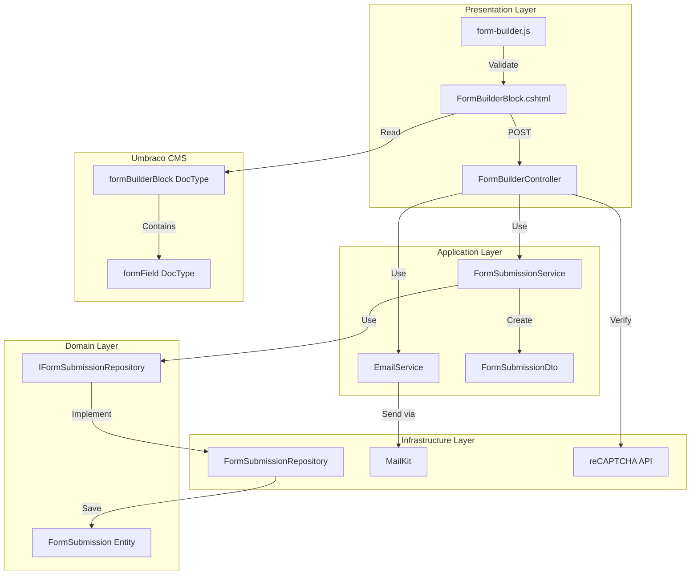
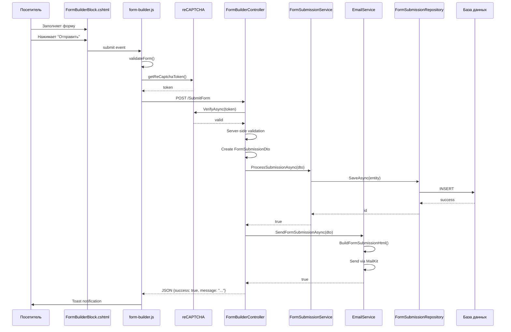
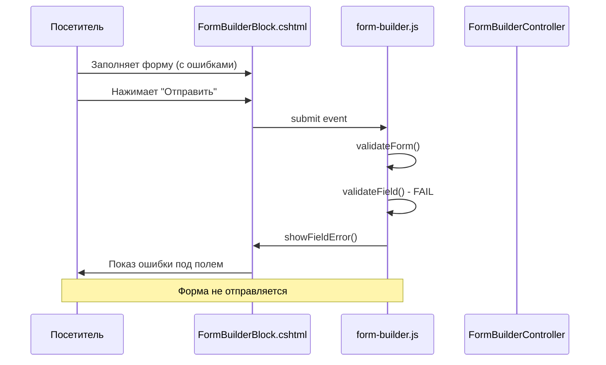
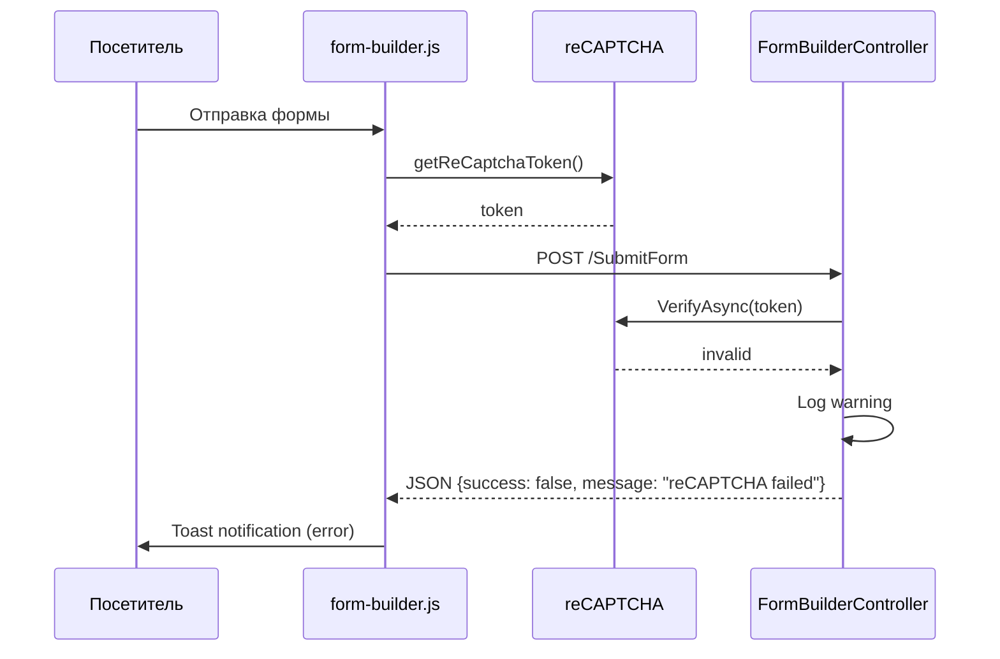

# Документ проектирования: Конструктор форм для Umbraco CMS

## Обзор

Конструктор форм - это модульное расширение для Umbraco CMS, которое позволяет редакторам контента создавать динамические формы обратной связи через бэкофис. Система построена на существующей архитектуре проекта с использованием паттернов MVC, Repository, Dependency Injection и интегрируется с текущими сервисами email (MailKit) и защиты от спама (reCAPTCHA).

Архитектура следует принципам разделения ответственности:
- **Presentation Layer** (Controllers, Views) - обработка HTTP запросов и рендеринг UI
- **Application Layer** (Services, DTOs) - бизнес-логика и оркестрация
- **Domain Layer** (Entities, Interfaces) - доменные модели и контракты
- **Infrastructure Layer** (Repositories, External Services) - доступ к данным и внешним API

## Архитектура

### Общая структура

```
TestUmbraco/
├── Controllers/
│   └── FormBuilderController.cs (SurfaceController)
├── Views/
│   └── Partials/
│       └── FormBuilderBlock.cshtml
├── wwwroot/
│   └── js/
│       └── form-builder.js (client-side валидация)

TestUmbraco.Application/
├── DTOs/
│   ├── FormSubmissionDto.cs
│   └── FormFieldDto.cs
├── Services/
│   ├── IEmailService.cs (расширение)
│   ├── EmailService.cs (расширение)
│   ├── IFormSubmissionService.cs
│   └── FormSubmissionService.cs

TestUmbraco.Domain/
├── Entities/
│   └── FormSubmission.cs
└── Repositories/
    └── IFormSubmissionRepository.cs

TestUmbraco.Infrastructure/ (если есть)
└── Repositories/
    └── FormSubmissionRepository.cs
```

### Диаграмма компонентов



## Компоненты и интерфейсы

### 1. Document Types (Umbraco CMS)

#### formField Document Type

Определяет структуру одного поля формы.

**Свойства:**
```csharp
// Alias: formField
{
    fieldLabel: string,          // Textstring - Надпись над полем
    fieldType: string,           // Dropdown - Тип поля
    fieldPlaceholder: string,    // Textstring - Placeholder
    isRequired: bool,            // Checkbox - Обязательное поле
    validationPattern: string,   // Textstring - Regex для валидации
    errorMessage: string         // Textstring - Сообщение об ошибке
}
```

**Допустимые значения fieldType:**
- `text` - Однострочное текстовое поле
- `email` - Email поле с валидацией
- `phone` - Телефонное поле
- `textarea` - Многострочное текстовое поле
- `checkbox` - Чекбокс
- `radio` - Радио-кнопка
- `select` - Выпадающий список

#### formBuilderBlock Document Type

Определяет полную конфигурацию формы.

**Вкладка "Form Settings":**
```csharp
{
    formTitle: string,              // Textstring - Заголовок формы
    formDescription: string,        // Textarea - Описание
    formFields: BlockList,          // Block List элементов formField
    submitButtonText: string        // Textstring - Текст кнопки (default: "Отправить")
}
```

**Вкладка "Email Settings":**
```csharp
{
    emailRecipient: string,         // Textstring - Email получателя
    emailSubject: string,           // Textstring - Тема письма
    successMessage: string,         // Textarea - Сообщение об успехе
    redirectPage: IPublishedContent // Content Picker - Страница редиректа (optional)
}
```

### 2. Data Transfer Objects (DTOs)

#### FormSubmissionDto

```csharp
namespace TestUmbraco.Application.DTOs
{
    public class FormSubmissionDto
    {
        public int FormId { get; set; }
        public string FormTitle { get; set; }
        public DateTime SubmittedAt { get; set; }
        public string IpAddress { get; set; }
        public Dictionary<string, string> FieldValues { get; set; }
        
        public FormSubmissionDto()
        {
            FieldValues = new Dictionary<string, string>();
            SubmittedAt = DateTime.UtcNow;
        }
    }
}
```

#### FormFieldDto

```csharp
namespace TestUmbraco.Application.DTOs
{
    public class FormFieldDto
    {
        public string Label { get; set; }
        public string Type { get; set; }
        public string Placeholder { get; set; }
        public bool IsRequired { get; set; }
        public string ValidationPattern { get; set; }
        public string ErrorMessage { get; set; }
        public string Name { get; set; } // Генерируется из Label
        public string Value { get; set; }
    }
}
```

### 3. Domain Entities

#### FormSubmission Entity

```csharp
namespace TestUmbraco.Domain.Entities
{
    public class FormSubmission
    {
        public int Id { get; set; }
        public int FormId { get; set; }
        public string FormTitle { get; set; }
        public DateTime SubmittedAt { get; set; }
        public string IpAddress { get; set; }
        public string FieldValuesJson { get; set; } // JSON сериализация Dictionary
        public DateTime CreatedAt { get; set; }
        
        public FormSubmission()
        {
            CreatedAt = DateTime.UtcNow;
        }
    }
}
```

### 4. Repository Interfaces and Implementations

#### IFormSubmissionRepository

```csharp
namespace TestUmbraco.Domain.Repositories
{
    public interface IFormSubmissionRepository
    {
        Task<int> SaveAsync(FormSubmission submission);
        Task<FormSubmission> GetByIdAsync(int id);
        Task<IEnumerable<FormSubmission>> GetByFormIdAsync(int formId);
        Task<IEnumerable<FormSubmission>> GetAllAsync(int pageNumber, int pageSize);
    }
}
```

#### FormSubmissionRepository

```csharp
namespace TestUmbraco.Infrastructure.Repositories
{
    public class FormSubmissionRepository : IFormSubmissionRepository
    {
        private readonly IUmbracoDatabase _database;
        
        public FormSubmissionRepository(IUmbracoDatabase database)
        {
            _database = database;
        }
        
        public async Task<int> SaveAsync(FormSubmission submission)
        {
            // Использует Umbraco Database API для вставки записи
            // Возвращает ID созданной записи
        }
        
        public async Task<FormSubmission> GetByIdAsync(int id)
        {
            // Получение записи по ID
        }
        
        public async Task<IEnumerable<FormSubmission>> GetByFormIdAsync(int formId)
        {
            // Получение всех отправок конкретной формы
        }
        
        public async Task<IEnumerable<FormSubmission>> GetAllAsync(int pageNumber, int pageSize)
        {
            // Получение всех отправок с пагинацией
        }
    }
}
```

### 5. Application Services

#### IFormSubmissionService

```csharp
namespace TestUmbraco.Application.Services
{
    public interface IFormSubmissionService
    {
        Task<bool> ProcessSubmissionAsync(FormSubmissionDto dto);
        Task<IEnumerable<FormSubmission>> GetSubmissionsByFormAsync(int formId);
    }
}
```

#### FormSubmissionService

```csharp
namespace TestUmbraco.Application.Services
{
    public class FormSubmissionService : IFormSubmissionService
    {
        private readonly IFormSubmissionRepository _repository;
        private readonly ILogger<FormSubmissionService> _logger;
        
        public FormSubmissionService(
            IFormSubmissionRepository repository,
            ILogger<FormSubmissionService> logger)
        {
            _repository = repository;
            _logger = logger;
        }
        
        public async Task<bool> ProcessSubmissionAsync(FormSubmissionDto dto)
        {
            try
            {
                var entity = new FormSubmission
                {
                    FormId = dto.FormId,
                    FormTitle = dto.FormTitle,
                    SubmittedAt = dto.SubmittedAt,
                    IpAddress = dto.IpAddress,
                    FieldValuesJson = JsonConvert.SerializeObject(dto.FieldValues)
                };
                
                await _repository.SaveAsync(entity);
                return true;
            }
            catch (Exception ex)
            {
                _logger.LogError(ex, "Ошибка при сохранении отправки формы");
                return false;
            }
        }
        
        public async Task<IEnumerable<FormSubmission>> GetSubmissionsByFormAsync(int formId)
        {
            return await _repository.GetByFormIdAsync(formId);
        }
    }
}
```

#### IEmailService (расширение)

```csharp
namespace TestUmbraco.Application.Services
{
    public interface IEmailService
    {
        // Существующие методы...
        
        Task<bool> SendFormSubmissionAsync(
            FormSubmissionDto submission,
            string recipientEmail,
            string subject);
    }
}
```

#### EmailService (расширение)

```csharp
namespace TestUmbraco.Application.Services
{
    public partial class EmailService : IEmailService
    {
        public async Task<bool> SendFormSubmissionAsync(
            FormSubmissionDto submission,
            string recipientEmail,
            string subject)
        {
            try
            {
                var htmlBody = BuildFormSubmissionHtml(submission);
                
                var message = new MimeMessage();
                message.From.Add(new MailboxAddress(_smtpSettings.FromName, _smtpSettings.FromEmail));
                message.To.Add(MailboxAddress.Parse(recipientEmail));
                message.Subject = subject;
                
                var bodyBuilder = new BodyBuilder { HtmlBody = htmlBody };
                message.Body = bodyBuilder.ToMessageBody();
                
                using var client = new SmtpClient();
                await client.ConnectAsync(_smtpSettings.Host, _smtpSettings.Port, _smtpSettings.EnableSsl);
                await client.AuthenticateAsync(_smtpSettings.Username, _smtpSettings.Password);
                await client.SendAsync(message);
                await client.DisconnectAsync(true);
                
                return true;
            }
            catch (Exception ex)
            {
                _logger.LogError(ex, "Ошибка при отправке email формы");
                return false;
            }
        }
        
        private string BuildFormSubmissionHtml(FormSubmissionDto submission)
        {
            var sb = new StringBuilder();
            sb.AppendLine("<html><body>");
            sb.AppendLine($"<h2>{submission.FormTitle}</h2>");
            sb.AppendLine($"<p><strong>Дата отправки:</strong> {submission.SubmittedAt:dd.MM.yyyy HH:mm}</p>");
            sb.AppendLine($"<p><strong>IP адрес:</strong> {submission.IpAddress}</p>");
            sb.AppendLine("<hr/>");
            sb.AppendLine("<h3>Данные формы:</h3>");
            sb.AppendLine("<table border='1' cellpadding='5' cellspacing='0'>");
            
            foreach (var field in submission.FieldValues)
            {
                sb.AppendLine("<tr>");
                sb.AppendLine($"<td><strong>{field.Key}</strong></td>");
                sb.AppendLine($"<td>{field.Value}</td>");
                sb.AppendLine("</tr>");
            }
            
            sb.AppendLine("</table>");
            sb.AppendLine("</body></html>");
            
            return sb.ToString();
        }
    }
}
```

### 6. Controllers

#### FormBuilderController

```csharp
namespace TestUmbraco.Controllers
{
    public class FormBuilderController : SurfaceController
    {
        private readonly IEmailService _emailService;
        private readonly IFormSubmissionService _submissionService;
        private readonly IReCaptchaService _reCaptchaService;
        private readonly ILogger<FormBuilderController> _logger;
        
        public FormBuilderController(
            IUmbracoContextAccessor umbracoContextAccessor,
            IUmbracoDatabaseFactory databaseFactory,
            ServiceContext services,
            AppCaches appCaches,
            IProfilingLogger profilingLogger,
            IPublishedUrlProvider publishedUrlProvider,
            IEmailService emailService,
            IFormSubmissionService submissionService,
            IReCaptchaService reCaptchaService,
            ILogger<FormBuilderController> logger)
            : base(umbracoContextAccessor, databaseFactory, services, appCaches, profilingLogger, publishedUrlProvider)
        {
            _emailService = emailService;
            _submissionService = submissionService;
            _reCaptchaService = reCaptchaService;
            _logger = logger;
        }
        
        [HttpPost]
        [ValidateAntiForgeryToken]
        public async Task<IActionResult> SubmitForm(FormSubmissionModel model)
        {
            // 1. Проверка reCAPTCHA
            var reCaptchaValid = await _reCaptchaService.VerifyAsync(model.ReCaptchaToken);
            if (!reCaptchaValid)
            {
                return Json(new { success = false, message = "Проверка reCAPTCHA не пройдена" });
            }
            
            // 2. Server-side валидация
            if (!ModelState.IsValid)
            {
                return Json(new { success = false, message = "Проверьте правильность заполнения полей" });
            }
            
            // 3. Получение настроек формы из Umbraco
            var formNode = Umbraco.Content(model.FormId);
            if (formNode == null)
            {
                return Json(new { success = false, message = "Форма не найдена" });
            }
            
            // 4. Создание DTO
            var dto = new FormSubmissionDto
            {
                FormId = model.FormId,
                FormTitle = formNode.Value<string>("formTitle"),
                SubmittedAt = DateTime.UtcNow,
                IpAddress = HttpContext.Connection.RemoteIpAddress?.ToString(),
                FieldValues = model.Fields
            };
            
            // 5. Сохранение в БД
            var saved = await _submissionService.ProcessSubmissionAsync(dto);
            if (!saved)
            {
                _logger.LogWarning("Не удалось сохранить отправку формы в БД, но продолжаем обработку");
            }
            
            // 6. Отправка email
            var emailRecipient = formNode.Value<string>("emailRecipient");
            var emailSubject = formNode.Value<string>("emailSubject");
            var emailSent = await _emailService.SendFormSubmissionAsync(dto, emailRecipient, emailSubject);
            
            if (!emailSent)
            {
                return Json(new { success = false, message = "Ошибка при отправке формы" });
            }
            
            // 7. Возврат результата
            var redirectPage = formNode.Value<IPublishedContent>("redirectPage");
            if (redirectPage != null)
            {
                return Json(new { success = true, redirect = redirectPage.Url() });
            }
            
            var successMessage = formNode.Value<string>("successMessage");
            return Json(new { success = true, message = successMessage });
        }
    }
}
```

#### FormSubmissionModel

```csharp
namespace TestUmbraco.Models
{
    public class FormSubmissionModel
    {
        public int FormId { get; set; }
        public Dictionary<string, string> Fields { get; set; }
        public string ReCaptchaToken { get; set; }
        
        public FormSubmissionModel()
        {
            Fields = new Dictionary<string, string>();
        }
    }
}
```

### 7. Views

#### FormBuilderBlock.cshtml

```cshtml
@inherits Umbraco.Cms.Web.Common.Views.UmbracoViewPage<IPublishedContent>
@using Umbraco.Cms.Core.Models.Blocks

@{
    var formTitle = Model.Value<string>("formTitle");
    var formDescription = Model.Value<string>("formDescription");
    var formFields = Model.Value<BlockListModel>("formFields");
    var submitButtonText = Model.Value<string>("submitButtonText", fallback: Fallback.To("Отправить"));
    var formId = Model.Id;
}

<div class="form-builder-block" data-form-id="@formId">
    @if (!string.IsNullOrEmpty(formTitle))
    {
        <h2 class="form-title">@formTitle</h2>
    }
    
    @if (!string.IsNullOrEmpty(formDescription))
    {
        <p class="form-description">@formDescription</p>
    }
    
    <form id="form-@formId" class="form-builder" method="post" action="@Url.SurfaceAction("SubmitForm", "FormBuilder")" novalidate>
        @Html.AntiForgeryToken()
        <input type="hidden" name="FormId" value="@formId" />
        <input type="hidden" name="ReCaptchaToken" id="recaptcha-token-@formId" />
        
        @if (formFields != null)
        {
            foreach (var block in formFields)
            {
                var field = block.Content;
                var fieldLabel = field.Value<string>("fieldLabel");
                var fieldType = field.Value<string>("fieldType");
                var fieldPlaceholder = field.Value<string>("fieldPlaceholder");
                var isRequired = field.Value<bool>("isRequired");
                var validationPattern = field.Value<string>("validationPattern");
                var errorMessage = field.Value<string>("errorMessage");
                var fieldName = $"Fields[{fieldLabel}]";
                
                <div class="form-group">
                    <label for="@fieldName">
                        @fieldLabel
                        @if (isRequired)
                        {
                            <span class="required">*</span>
                        }
                    </label>
                    
                    @switch (fieldType)
                    {
                        case "text":
                            <input type="text" 
                                   id="@fieldName" 
                                   name="@fieldName" 
                                   class="form-control" 
                                   placeholder="@fieldPlaceholder"
                                   data-required="@isRequired.ToString().ToLower()"
                                   data-pattern="@validationPattern"
                                   data-error="@errorMessage" />
                            break;
                            
                        case "email":
                            <input type="email" 
                                   id="@fieldName" 
                                   name="@fieldName" 
                                   class="form-control" 
                                   placeholder="@fieldPlaceholder"
                                   data-required="@isRequired.ToString().ToLower()"
                                   data-pattern="@validationPattern"
                                   data-error="@errorMessage" />
                            break;
                            
                        case "phone":
                            <input type="tel" 
                                   id="@fieldName" 
                                   name="@fieldName" 
                                   class="form-control" 
                                   placeholder="@fieldPlaceholder"
                                   data-required="@isRequired.ToString().ToLower()"
                                   data-pattern="@validationPattern"
                                   data-error="@errorMessage" />
                            break;
                            
                        case "textarea":
                            <textarea id="@fieldName" 
                                      name="@fieldName" 
                                      class="form-control" 
                                      placeholder="@fieldPlaceholder"
                                      rows="5"
                                      data-required="@isRequired.ToString().ToLower()"
                                      data-pattern="@validationPattern"
                                      data-error="@errorMessage"></textarea>
                            break;
                            
                        case "checkbox":
                            <div class="form-check">
                                <input type="checkbox" 
                                       id="@fieldName" 
                                       name="@fieldName" 
                                       class="form-check-input" 
                                       value="true"
                                       data-required="@isRequired.ToString().ToLower()"
                                       data-error="@errorMessage" />
                            </div>
                            break;
                            
                        case "radio":
                            <div class="form-check">
                                <input type="radio" 
                                       id="@fieldName" 
                                       name="@fieldName" 
                                       class="form-check-input" 
                                       value="true"
                                       data-required="@isRequired.ToString().ToLower()"
                                       data-error="@errorMessage" />
                            </div>
                            break;
                            
                        case "select":
                            <select id="@fieldName" 
                                    name="@fieldName" 
                                    class="form-control"
                                    data-required="@isRequired.ToString().ToLower()"
                                    data-error="@errorMessage">
                                <option value="">Выберите...</option>
                                <!-- Опции должны быть настраиваемыми через дополнительное свойство -->
                            </select>
                            break;
                    }
                    
                    <span class="field-error text-danger" style="display:none;"></span>
                </div>
            }
        }
        
        <div class="g-recaptcha" data-sitekey="@Configuration["ReCaptcha:SiteKey"]" data-size="invisible"></div>
        
        <button type="submit" class="btn btn-primary">@submitButtonText</button>
    </form>
</div>

@section Scripts {
    <script src="https://www.google.com/recaptcha/api.js" async defer></script>
    <script src="/js/form-builder.js"></script>
}
```

### 8. Client-side JavaScript

#### form-builder.js

```javascript
// Client-side валидация и обработка отправки формы
(function() {
    'use strict';
    
    // Инициализация всех форм на странице
    document.addEventListener('DOMContentLoaded', function() {
        const forms = document.querySelectorAll('.form-builder');
        forms.forEach(form => initializeForm(form));
    });
    
    function initializeForm(form) {
        form.addEventListener('submit', async function(e) {
            e.preventDefault();
            
            // Client-side валидация
            if (!validateForm(form)) {
                return;
            }
            
            // Получение reCAPTCHA токена
            const formId = form.closest('.form-builder-block').dataset.formId;
            const token = await getReCaptchaToken();
            document.getElementById(`recaptcha-token-${formId}`).value = token;
            
            // Отправка формы через AJAX
            submitForm(form);
        });
        
        // Real-time валидация полей
        const fields = form.querySelectorAll('input, textarea, select');
        fields.forEach(field => {
            field.addEventListener('blur', () => validateField(field));
            field.addEventListener('input', () => clearFieldError(field));
        });
    }
    
    function validateForm(form) {
        let isValid = true;
        const fields = form.querySelectorAll('[data-required="true"]');
        
        fields.forEach(field => {
            if (!validateField(field)) {
                isValid = false;
            }
        });
        
        return isValid;
    }
    
    function validateField(field) {
        const isRequired = field.dataset.required === 'true';
        const pattern = field.dataset.pattern;
        const errorMessage = field.dataset.error || 'Поле заполнено некорректно';
        const value = field.value.trim();
        
        // Проверка обязательности
        if (isRequired && !value) {
            showFieldError(field, 'Это поле обязательно для заполнения');
            return false;
        }
        
        // Проверка паттерна
        if (pattern && value) {
            const regex = new RegExp(pattern);
            if (!regex.test(value)) {
                showFieldError(field, errorMessage);
                return false;
            }
        }
        
        // Проверка email
        if (field.type === 'email' && value) {
            const emailRegex = /^[^\s@]+@[^\s@]+\.[^\s@]+$/;
            if (!emailRegex.test(value)) {
                showFieldError(field, 'Введите корректный email адрес');
                return false;
            }
        }
        
        // Проверка телефона
        if (field.type === 'tel' && value) {
            const phoneRegex = /^[\d\s\+\-\(\)]+$/;
            if (!phoneRegex.test(value)) {
                showFieldError(field, 'Введите корректный номер телефона');
                return false;
            }
        }
        
        clearFieldError(field);
        return true;
    }
    
    function showFieldError(field, message) {
        const formGroup = field.closest('.form-group');
        const errorSpan = formGroup.querySelector('.field-error');
        errorSpan.textContent = message;
        errorSpan.style.display = 'block';
        field.classList.add('is-invalid');
    }
    
    function clearFieldError(field) {
        const formGroup = field.closest('.form-group');
        const errorSpan = formGroup.querySelector('.field-error');
        errorSpan.style.display = 'none';
        field.classList.remove('is-invalid');
    }
    
    async function getReCaptchaToken() {
        return new Promise((resolve) => {
            grecaptcha.ready(() => {
                grecaptcha.execute(document.querySelector('.g-recaptcha').dataset.sitekey, {action: 'submit'})
                    .then(token => resolve(token));
            });
        });
    }
    
    async function submitForm(form) {
        const formData = new FormData(form);
        const submitButton = form.querySelector('button[type="submit"]');
        
        // Блокировка кнопки
        submitButton.disabled = true;
        submitButton.textContent = 'Отправка...';
        
        try {
            const response = await fetch(form.action, {
                method: 'POST',
                body: formData
            });
            
            const result = await response.json();
            
            if (result.success) {
                if (result.redirect) {
                    window.location.href = result.redirect;
                } else {
                    showToast(result.message || 'Форма успешно отправлена', 'success');
                    form.reset();
                }
            } else {
                showToast(result.message || 'Произошла ошибка при отправке формы', 'error');
            }
        } catch (error) {
            showToast('Произошла ошибка при отправке формы', 'error');
        } finally {
            submitButton.disabled = false;
            submitButton.textContent = form.dataset.submitText || 'Отправить';
        }
    }
    
    function showToast(message, type) {
        // Интеграция с существующей системой Toast notifications
        if (window.toastNotification) {
            window.toastNotification.show(message, type);
        } else {
            alert(message);
        }
    }
})();
```

## Модели данных

### Database Schema

```sql
CREATE TABLE FormSubmissions (
    Id INT PRIMARY KEY IDENTITY(1,1),
    FormId INT NOT NULL,
    FormTitle NVARCHAR(255) NOT NULL,
    SubmittedAt DATETIME NOT NULL,
    IpAddress NVARCHAR(50),
    FieldValuesJson NVARCHAR(MAX) NOT NULL,
    CreatedAt DATETIME NOT NULL DEFAULT GETUTCDATE(),
    INDEX IX_FormSubmissions_FormId (FormId),
    INDEX IX_FormSubmissions_SubmittedAt (SubmittedAt)
);
```

### FieldValuesJson Structure

```json
{
    "Имя": "Иван Петров",
    "Email": "ivan@example.com",
    "Телефон": "+7 (999) 123-45-67",
    "Сообщение": "Текст сообщения..."
}
```

## Свойства корректности

*Свойство - это характеристика или поведение, которое должно выполняться во всех валидных выполнениях системы - по сути, формальное утверждение о том, что система должна делать. Свойства служат мостом между человекочитаемыми спецификациями и машинопроверяемыми гарантиями корректности.*


### Рефлексия свойств

После анализа критериев приемки выявлены следующие группы свойств, которые можно объединить:

**Группа 1: Валидация полей (клиент и сервер)**
- Свойства 4.1, 4.2, 5.1, 5.2 можно объединить в одно свойство о валидации обязательных полей и паттернов
- Свойства 4.3, 4.4, 5.4 можно объединить в одно свойство о валидации типов полей

**Группа 2: Рендеринг полей формы**
- Свойства 3.4-3.10 можно объединить в одно свойство о соответствии типа поля и HTML элемента
- Свойства 3.11, 3.12, 3.13 можно объединить в одно свойство о корректности атрибутов полей

**Группа 3: Обработка отправки формы**
- Свойства 7.1, 8.1 описывают создание объектов при валидной отправке - можно объединить
- Свойства 7.5, 10.4 описывают включение всех полей в email - это одно свойство

**Группа 4: Обработка результатов**
- Свойства 9.1, 9.2 описывают разные сценарии успешной отправки - оставить раздельными
- Свойства 9.4, 9.5 - специфичные примеры ошибок, не свойства

**Группа 5: Валидация с паттернами**
- Свойства 14.1, 14.2, 14.3 описывают одно поведение валидации по паттерну - объединить

### Свойства корректности

#### Свойство 1: Соответствие типа поля и HTML элемента

*Для любого* поля формы с заданным fieldType, система должна создать соответствующий HTML элемент:
- "text" → input type="text"
- "email" → input type="email"
- "phone" → input type="tel"
- "textarea" → textarea
- "checkbox" → input type="checkbox"
- "radio" → input type="radio"
- "select" → select

**Валидирует: Требования 3.4, 3.5, 3.6, 3.7, 3.8, 3.9, 3.10, 13.1-13.8**

#### Свойство 2: Корректность атрибутов полей формы

*Для любого* поля формы, система должна корректно установить атрибуты:
- Если fieldLabel задан → создать label элемент с этим текстом
- Если fieldPlaceholder задан → установить атрибут placeholder
- Если isRequired = true → добавить атрибут required

**Валидирует: Требования 3.11, 3.12, 3.13**

#### Свойство 3: Количество полей соответствует конфигурации

*Для любого* списка полей formFields, количество созданных HTML элементов формы должно равняться количеству элементов в списке.

**Валидирует: Требования 3.3**

#### Свойство 4: Валидация обязательных полей

*Для любого* поля с isRequired = true, если значение пустое или состоит только из пробелов, система должна:
- На клиенте: предотвратить отправку формы и показать сообщение об ошибке
- На сервере: вернуть ошибку валидации

**Валидирует: Требования 4.1, 5.1**

#### Свойство 5: Валидация по регулярному выражению

*Для любого* поля с заданным validationPattern, если значение не соответствует регулярному выражению, система должна:
- На клиенте: показать errorMessage и предотвратить отправку
- На сервере: вернуть ошибку валидации с errorMessage

**Валидирует: Требования 4.2, 5.2, 14.1, 14.2, 14.3**

#### Свойство 6: Валидация типов полей

*Для любого* поля:
- С типом "email": некорректный email адрес должен вызывать ошибку валидации (клиент и сервер)
- С типом "phone": некорректный номер телефона должен вызывать ошибку валидации (клиент и сервер)

**Валидирует: Требования 4.3, 4.4, 5.4**

#### Свойство 7: Успешная валидация разрешает отправку

*Для любой* формы, если все обязательные поля заполнены корректно и все паттерны валидации пройдены, система должна разрешить отправку формы.

**Валидирует: Требования 4.5, 5.5**

#### Свойство 8: Проверка reCAPTCHA обязательна

*Для любого* POST запроса к FormBuilderController, система должна:
- Проверить наличие reCAPTCHA токена
- Валидировать токен через API Google
- Если токен невалиден → отклонить отправку с сообщением об ошибке
- Если токен валиден → продолжить обработку

**Валидирует: Требования 6.3, 6.4, 6.5**

#### Свойство 9: Создание DTO при валидной отправке

*Для любой* валидной отправки формы (прошедшей валидацию и reCAPTCHA), система должна создать FormSubmissionDto со всеми данными:
- FormId
- FormTitle
- SubmittedAt (текущая дата/время)
- IpAddress (IP отправителя)
- FieldValues (все поля формы)

**Валидирует: Требования 7.1, 11.2**

#### Свойство 10: Все поля включены в email

*Для любого* FormSubmissionDto, при формировании email система должна включить:
- Все пары "fieldLabel - значение" из FieldValues
- Дату и время отправки
- IP адрес отправителя

**Валидирует: Требования 7.5, 7.6, 10.3, 10.4**

#### Свойство 11: Email отправляется на правильный адрес с правильной темой

*Для любого* вызова SendFormSubmissionAsync, система должна:
- Отправить email на адрес из параметра recipientEmail
- Использовать параметр subject как тему письма

**Валидирует: Требования 7.3, 7.4**

#### Свойство 12: Сохранение отправки в базу данных

*Для любой* валидной отправки формы, система должна создать сущность FormSubmission и сохранить её через Repository со всеми данными:
- FormId
- FormTitle
- SubmittedAt
- IpAddress
- FieldValuesJson (сериализованный Dictionary)

**Валидирует: Требования 8.1, 8.2, 8.4**

#### Свойство 13: Обработка продолжается при ошибке БД

*Для любой* ошибки сохранения в базу данных, система должна:
- Залогировать ошибку
- Продолжить обработку (отправить email)
- Не блокировать успешный результат для пользователя

**Валидирует: Требования 8.5**

#### Свойство 14: Уведомление об успешной отправке

*Для любой* успешно обработанной отправки формы:
- Если redirectPage указана → выполнить редирект на эту страницу
- Если redirectPage не указана → показать Toast notification с текстом из successMessage

**Валидирует: Требования 9.1, 9.2**

#### Свойство 15: Уведомление об ошибках

*Для любой* ошибки при обработке формы, система должна показать Toast notification с соответствующим сообщением:
- Ошибка валидации → описание ошибок валидации
- Системная ошибка → общее сообщение об ошибке

**Валидирует: Требования 9.3, 9.6**

#### Свойство 16: FieldValues использует fieldLabel как ключ

*Для любого* поля формы, при заполнении Dictionary FieldValues система должна использовать fieldLabel как ключ и введенное пользователем значение как значение.

**Валидирует: Требования 11.3**

#### Свойство 17: Сохранность данных DTO при передаче

*Для любого* FormSubmissionDto, при передаче между слоями (Controller → Service → Repository) все данные должны сохраняться без потерь.

**Валидирует: Требования 11.4**

#### Свойство 18: Обработка некорректного validationPattern

*Для любого* поля с некорректным validationPattern (невалидное регулярное выражение), система должна:
- Залогировать ошибку
- Пропустить кастомную валидацию
- Использовать только стандартную валидацию для типа поля

**Валидирует: Требования 14.5**

## Обработка ошибок

### Стратегия обработки ошибок

Система использует многоуровневую стратегию обработки ошибок:

1. **Client-side валидация** - первая линия защиты, предотвращает отправку невалидных данных
2. **Server-side валидация** - защита от обхода клиентской валидации
3. **reCAPTCHA** - защита от автоматических отправок
4. **Graceful degradation** - система продолжает работу при некритичных ошибках (например, ошибка БД не блокирует отправку email)

### Типы ошибок и их обработка

#### Ошибки валидации

**Клиентская сторона:**
```javascript
// Показ ошибки под полем
function showFieldError(field, message) {
    const errorSpan = field.closest('.form-group').querySelector('.field-error');
    errorSpan.textContent = message;
    errorSpan.style.display = 'block';
    field.classList.add('is-invalid');
}
```

**Серверная сторона:**
```csharp
if (!ModelState.IsValid)
{
    var errors = ModelState.Values
        .SelectMany(v => v.Errors)
        .Select(e => e.ErrorMessage);
    return Json(new { success = false, message = string.Join(", ", errors) });
}
```

#### Ошибки reCAPTCHA

```csharp
var reCaptchaValid = await _reCaptchaService.VerifyAsync(model.ReCaptchaToken);
if (!reCaptchaValid)
{
    _logger.LogWarning("reCAPTCHA validation failed for form {FormId}", model.FormId);
    return Json(new { 
        success = false, 
        message = "Проверка reCAPTCHA не пройдена. Попробуйте еще раз." 
    });
}
```

#### Ошибки базы данных

```csharp
var saved = await _submissionService.ProcessSubmissionAsync(dto);
if (!saved)
{
    _logger.LogWarning(
        "Failed to save form submission to database for form {FormId}, but continuing with email send", 
        model.FormId);
    // Продолжаем обработку - отправка email важнее сохранения в БД
}
```

#### Ошибки отправки email

```csharp
var emailSent = await _emailService.SendFormSubmissionAsync(dto, emailRecipient, emailSubject);
if (!emailSent)
{
    _logger.LogError("Failed to send email for form {FormId}", model.FormId);
    return Json(new { 
        success = false, 
        message = "Произошла ошибка при отправке формы. Попробуйте позже." 
    });
}
```

#### Общие системные ошибки

```csharp
try
{
    // Обработка формы
}
catch (Exception ex)
{
    _logger.LogError(ex, "Unexpected error processing form {FormId}", model.FormId);
    return Json(new { 
        success = false, 
        message = "Произошла системная ошибка. Попробуйте позже." 
    });
}
```

### Логирование

Все ошибки логируются с соответствующим уровнем:
- **Warning** - некритичные ошибки (ошибка БД, невалидная reCAPTCHA)
- **Error** - критичные ошибки (ошибка отправки email, системные ошибки)
- **Information** - успешные операции (для аудита)

```csharp
_logger.LogInformation(
    "Form {FormId} submitted successfully by IP {IpAddress}", 
    model.FormId, 
    HttpContext.Connection.RemoteIpAddress);
```

## Стратегия тестирования

### Двойной подход к тестированию

Система требует как unit-тестов, так и property-based тестов для обеспечения полного покрытия:

**Unit-тесты** фокусируются на:
- Конкретных примерах корректного поведения
- Специфичных edge cases (пустые значения, специальные символы)
- Интеграционных точках между компонентами
- Обработке специфичных ошибок (reCAPTCHA failed, email failed)

**Property-based тесты** фокусируются на:
- Универсальных свойствах, которые должны выполняться для всех входных данных
- Генерации большого количества случайных входных данных
- Проверке инвариантов системы
- Валидации бизнес-правил

### Конфигурация Property-Based тестов

**Библиотека:** FsCheck для C# (или аналог для выбранного языка)

**Минимальное количество итераций:** 100 на каждый property-тест

**Формат тегов:**
```csharp
[Property(MaxTest = 100)]
[Trait("Feature", "umbraco-form-builder")]
[Trait("Property", "1: Соответствие типа поля и HTML элемента")]
public Property FieldType_Should_Generate_Correct_HtmlElement()
{
    // Тест
}
```

### Примеры тестов

#### Unit-тест: Проверка рендеринга формы

```csharp
[Fact]
public void FormBuilderBlock_Should_Render_FormTitle()
{
    // Arrange
    var model = CreateFormBuilderBlockWithTitle("Контактная форма");
    
    // Act
    var html = RenderView("FormBuilderBlock", model);
    
    // Assert
    Assert.Contains("<h2 class=\"form-title\">Контактная форма</h2>", html);
}
```

#### Property-тест: Валидация обязательных полей

```csharp
[Property(MaxTest = 100)]
[Trait("Feature", "umbraco-form-builder")]
[Trait("Property", "4: Валидация обязательных полей")]
public Property RequiredField_WithEmptyValue_Should_FailValidation()
{
    return Prop.ForAll(
        Arb.From<FormFieldDto>().Where(f => f.IsRequired),
        field =>
        {
            // Arrange
            field.Value = string.Empty;
            var validator = new FormFieldValidator();
            
            // Act
            var result = validator.Validate(field);
            
            // Assert
            return !result.IsValid;
        });
}
```

#### Property-тест: Все поля включены в email

```csharp
[Property(MaxTest = 100)]
[Trait("Feature", "umbraco-form-builder")]
[Trait("Property", "10: Все поля включены в email")]
public Property Email_Should_Contain_AllFields()
{
    return Prop.ForAll(
        Arb.From<FormSubmissionDto>(),
        dto =>
        {
            // Arrange
            var emailService = new EmailService(_smtpSettings, _logger);
            
            // Act
            var html = emailService.BuildFormSubmissionHtml(dto);
            
            // Assert
            return dto.FieldValues.All(kvp => 
                html.Contains(kvp.Key) && html.Contains(kvp.Value));
        });
}
```

#### Integration-тест: Полный цикл отправки формы

```csharp
[Fact]
public async Task SubmitForm_WithValidData_Should_SendEmailAndSaveToDatabase()
{
    // Arrange
    var controller = CreateControllerWithMocks();
    var model = CreateValidFormSubmissionModel();
    
    // Act
    var result = await controller.SubmitForm(model);
    
    // Assert
    var jsonResult = Assert.IsType<JsonResult>(result);
    var data = jsonResult.Value as dynamic;
    Assert.True(data.success);
    
    _emailServiceMock.Verify(s => s.SendFormSubmissionAsync(
        It.IsAny<FormSubmissionDto>(), 
        It.IsAny<string>(), 
        It.IsAny<string>()), 
        Times.Once);
    
    _submissionServiceMock.Verify(s => s.ProcessSubmissionAsync(
        It.IsAny<FormSubmissionDto>()), 
        Times.Once);
}
```

### Генераторы для Property-Based тестов

```csharp
public static class FormGenerators
{
    public static Arbitrary<FormFieldDto> FormFieldGenerator()
    {
        return Arb.From(
            from label in Arb.Generate<NonEmptyString>()
            from type in Gen.Elements("text", "email", "phone", "textarea", "checkbox", "radio", "select")
            from isRequired in Arb.Generate<bool>()
            from pattern in Arb.Generate<string>()
            select new FormFieldDto
            {
                Label = label.Get,
                Type = type,
                IsRequired = isRequired,
                ValidationPattern = pattern
            });
    }
    
    public static Arbitrary<FormSubmissionDto> FormSubmissionGenerator()
    {
        return Arb.From(
            from formId in Arb.Generate<PositiveInt>()
            from title in Arb.Generate<NonEmptyString>()
            from fields in Gen.ListOf(FormFieldGenerator().Generator)
            select new FormSubmissionDto
            {
                FormId = formId.Get,
                FormTitle = title.Get,
                SubmittedAt = DateTime.UtcNow,
                IpAddress = "127.0.0.1",
                FieldValues = fields.ToDictionary(f => f.Label, f => f.Value ?? "")
            });
    }
}
```

### Покрытие тестами

**Обязательное покрытие:**
- Все 18 свойств корректности должны иметь property-based тесты
- Все публичные методы контроллеров и сервисов должны иметь unit-тесты
- Критичные пути (отправка формы, валидация, отправка email) должны иметь integration-тесты

**Минимальный порог покрытия:** 80% для всех слоев приложения

### Тестирование UI

**Client-side валидация:**
- Unit-тесты для JavaScript функций валидации
- E2E тесты для проверки взаимодействия пользователя с формой (опционально)

```javascript
// Jest unit-тест
describe('Form Validation', () => {
    test('validateField should return false for empty required field', () => {
        const field = createMockField({ required: true, value: '' });
        expect(validateField(field)).toBe(false);
    });
    
    test('validateField should return false for invalid email', () => {
        const field = createMockField({ type: 'email', value: 'invalid-email' });
        expect(validateField(field)).toBe(false);
    });
});
```

## Диаграммы последовательности

### Успешная отправка формы



### Ошибка валидации



### Ошибка reCAPTCHA


